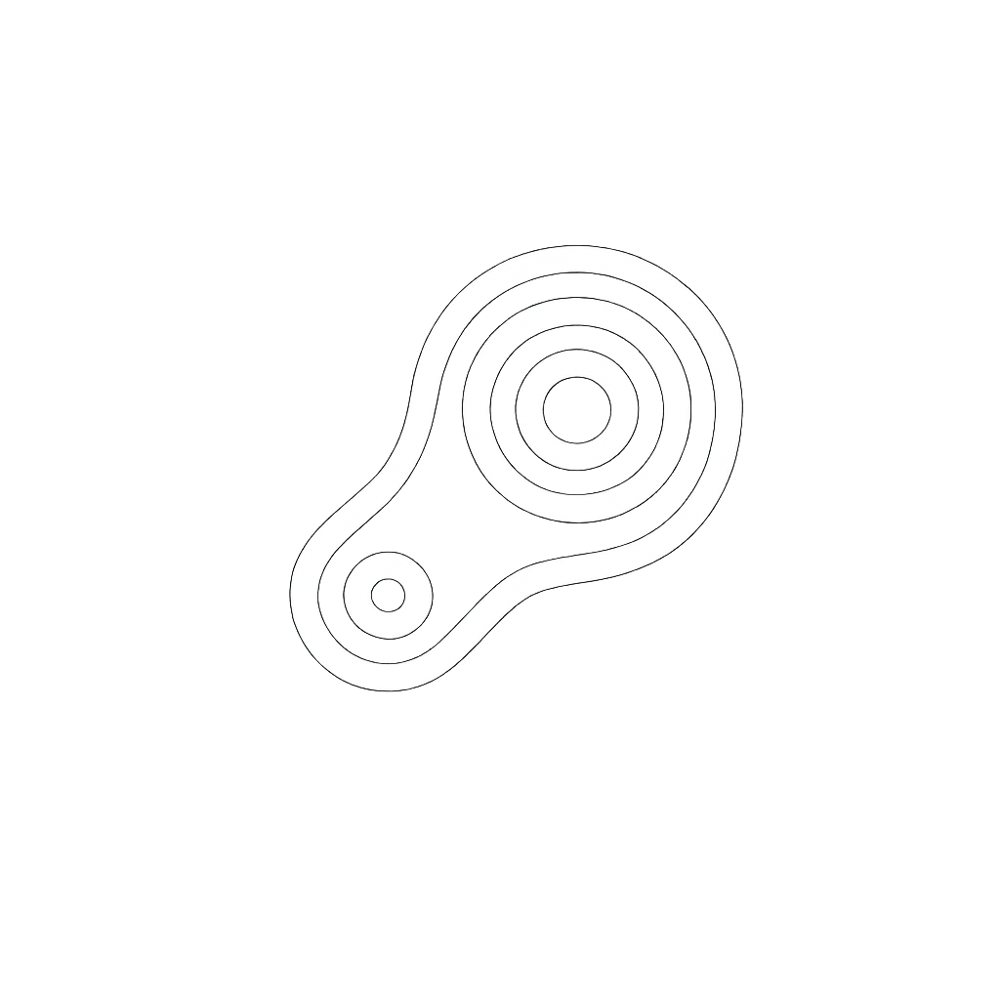

<p align="center">
  
</p>

<h1 align="center">DermAI</h1>
<p align="center">
  <b>Skin Cancer Risk Classification System</b><br/>
  <sub>Powered by Vision Transformer (ViT-base-patch16-224)</sub>
</p>

<p align="center">
  
  
  
  
  
</p>

---

## Overview

**DermAI** is a skin cancer risk classification system that uses a fine-tuned **Vision Transformer (ViT-base-patch16-224)** to classify 10 skin conditions and compute a **Cancer Risk Score (0–100)**. The system provides explainable predictions through attention map visualization, showing exactly which regions of the image drove the model's decision.

### Key Features
- **10-class** skin condition classification
- **Cancer Risk Score** (0–100) weighted by clinical malignancy severity
- **Attention map** visualization for model explainability
- **Risk group distribution** with interactive pie charts
- **PDF report** generation with charts and analysis
- **Model comparison** between ViT-base and EfficientNet-B3
- **Real-time inference** via Streamlit web application

---

## Demo

> Upload a close-up photo of a skin lesion and get an instant cancer risk assessment with attention map visualization.

```
https://huggingface.co/spaces/zyinaa/skin-cancer-risk-analyser
```

---

## Results

| Model | Test Macro F1 | Accuracy | Status |
|---|---|---|---|
| **ViT-base-patch16-224** | **0.7652** | **86%** | Main Model |
| EfficientNet-B3 | 0.7440 | 83% | Baseline |

### Per-Class Performance (ViT)

| Class | Risk Group | F1 Score |
|---|---|---|
| Healthy Skin | Low | 1.00 |
| Squamous Cell Carcinoma | High | 0.95 |
| Vascular Lesion | Low | 0.90 |
| Melanocytic Nevi | Medium | 0.91 |
| Tinea/Ringworm | Low | 0.87 |
| Basal Cell Carcinoma | High | 0.73 |
| Benign Keratosis | Medium | 0.68 |
| Melanoma | High | 0.54 |
| Actinic Keratosis | Medium | 0.57 |
| Dermatofibroma | Low | 0.50 |

---

## Dataset

### HAM10000 (Primary)
- 10,015 dermoscopic images across 7 classes
- Source: [Kaggle](https://www.kaggle.com/datasets/kmader/skin-cancer-mnist-ham10000) / [Harvard Dataverse](https://dataverse.harvard.edu/dataset.xhtml?persistentId=doi:10.7910/DVN/DBW86T)
- Citation: Tschandl et al., Scientific Data 2018

### Supplementary Kaggle Data
- Tinea/Ringworm: 122 images
- Squamous Cell Carcinoma: 322 images
- Healthy Skin (normal + dry + oily): 2,756 images

### Final Dataset
| Split | Images |
|---|---|
| Train | 9,890 |
| Validation | 1,979 |
| Test | 1,346 |
| **Total** | **13,215** |

---

## 10 Classes and Cancer Risk Weights

| Class | Code | Source | Risk Weight | Risk Group |
|---|---|---|---|---|
| Melanoma | mel | HAM10000 | 1.00 | 🔴 High |
| Squamous Cell Carcinoma | scc | Kaggle | 0.90 | 🔴 High |
| Basal Cell Carcinoma | bcc | HAM10000 | 0.80 | 🔴 High |
| Actinic Keratosis | akiec | HAM10000 | 0.65 | 🟡 Medium |
| Benign Keratosis | bkl | HAM10000 | 0.10 | 🟡 Medium |
| Melanocytic Nevi | nv | HAM10000 | 0.10 | 🟡 Medium |
| Dermatofibroma | df | HAM10000 | 0.05 | 🟢 Low |
| Vascular Lesion | vasc | HAM10000 | 0.05 | 🟢 Low |
| Tinea/Ringworm | tinea | Kaggle | 0.00 | 🟢 Low |
| Healthy Skin | normal | Kaggle | 0.00 | 🟢 Low |

**Cancer Risk Score** = Σ(P(class_i) × weight_i) × 100

---

## Model Architecture

### Vision Transformer (ViT-base-patch16-224)
- Pre-trained on ImageNet-21k (14M images, 21k classes)
- Input: 224×224 RGB images
- Patch size: 16×16 (196 patches + 1 CLS token)
- Encoder: 12 transformer layers, 12 attention heads
- Hidden dimension: 768
- Parameters: 86M

### Two-Phase Fine-tuning Strategy
```
Phase 1 (5 epochs):
  Freeze ViT encoder → Train classification head only
  Learning rate: 1e-3

Phase 2 (25 epochs):
  Unfreeze all layers → Full fine-tuning
  Learning rate: 5e-5
  CosineAnnealingLR + Label smoothing 0.1
```

---

## Repository Structure

```
Deep-Learning-Final-Project-Group-4/
├── icon.png                        # DermAI logo
├── README.md
├── Group-Proposal/
├── Final-Group-Project-Report/
├── Final-Group-Presentation/
└── Code/
    ├── preprocessing/
    │   ├── dataset.py              # Dataset class, transforms, data loading
    │   └── transforms.py
    ├── training/
    │   ├── train_vit.py            # ViT fine-tuning (Phase 1 + Phase 2)
    │   └── train_efficientnet.py   # EfficientNet-B3 baseline
    ├── models/
    │   └── saved/                  # Model weights (not on GitHub)
    ├── evaluation/
    │   └── evaluate.py
    ├── app/
    │   ├── app.py                  # DermAI Streamlit application
    │   └── icon.png                # App icon
    └── notebooks/
        └── eda.ipynb
```

---

## Quick Start

### 1. Clone the Repository
```bash
git clone https://github.com/zyinaa/Deep-Learning-Final-Project-Group-4.git
cd Deep-Learning-Final-Project-Group-4
```

### 2. Set Up Virtual Environment
```bash
python3 -m venv venv
source venv/bin/activate
pip install -r requirements.txt
pip install torch torchvision --index-url https://download.pytorch.org/whl/cu118
```

### 3. Download Data
```bash
kaggle datasets download -d kmader/skin-cancer-mnist-ham10000 -p Code/data/raw/ham10000 --unzip
kaggle datasets download -d haroonalam16/20-skin-diseases-dataset -p Code/data/raw/kaggle_diseases --unzip
kaggle datasets download -d shakyadissanayake/oily-dry-and-normal-skin-types-dataset -p Code/data/raw/kaggle_diseases --unzip
```

### 4. Train Models
```bash
cd Code
python3 training/train_efficientnet.py   # Baseline
python3 training/train_vit.py            # Main model
```

### 5. Run DermAI
```bash
streamlit run Code/app/app.py --server.port 8501 --server.address 0.0.0.0
```

---

## DermAI Features

### Cancer Risk Score
A weighted probability score (0–100) based on clinical malignancy severity:
| Score | Level | Color |
|---|---|---|
| 0–20 | Low Risk | 🟢 Green |
| 20–50 | Moderate Risk | 🟡 Yellow |
| 50–75 | Elevated Risk | 🟠 Orange |
| 75–100 | High Risk | 🔴 Red |

### Attention Map
ViT's self-attention weights overlaid on the input image, showing which regions drove the prediction — analogous to the ABCDE criteria used by dermatologists.

### PDF Report
Downloadable report including risk summary, group distribution pie charts, class probability bar chart, and detailed analysis.

### Model Comparison
Side-by-side comparison between ViT-base (main model) and EfficientNet-B3 (baseline).

---

## AWS Training Environment

```
Instance:  g5.xlarge
GPU:       NVIDIA A10G (23.6 GB VRAM)
CUDA:      11.8
PyTorch:   2.7.1+cu118
Python:    3.12.3
```

---

## Citation

```bibtex
@article{tschandl2018ham10000,
  title={The HAM10000 dataset, a large collection of multi-source
         dermatoscopic images of common pigmented skin lesions},
  author={Tschandl, Philipp and Rosendahl, Cliff and Kittler, Harald},
  journal={Scientific data},
  volume={5},
  pages={180161},
  year={2018}
}

@article{dosovitskiy2020vit,
  title={An image is worth 16x16 words: Transformers for image
         recognition at scale},
  author={Dosovitskiy, Alexey and others},
  journal={arXiv preprint arXiv:2010.11929},
  year={2020}
}
```

---

## Team

| Member | Responsibilities |
|---|---|
| Enoch Yin | Dataset pipeline, ViT fine-tuning, EfficientNet baseline, cancer risk score, attention maps, model evaluation, deployment |
| Gary Liang | EDA, data augmentation, Streamlit app, demo preparation, report |

---

## License

Educational use only — GWU DATS 6303 Deep Learning | Spring 2026
HAM10000 dataset licensed under CC-BY-NC-SA-4.0

---

<p align="center">
  <sub>Built with ViT · HAM10000 · Streamlit · PyTorch</sub>
</p>
